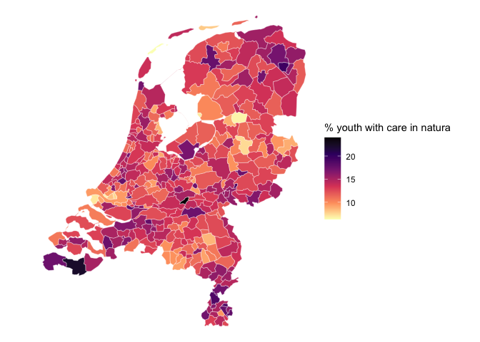

[Statistics Netherlands (CBS)](https://www.cbs.nl) is the office that
produces all official statistics of the Netherlands.

Besides statistical data, SN also publishes cartographic maps,
i.e. administrative areas such as “gemeenten” (municipalities),
“buurten” (neighborhoods), “wijken” (districts) and many more. The main
outlet for publishing these CBS specific geospatial data is via
[Publieke Diensten op de Kaart (PDOK)](https://pdok.nl), which offers a
wide range of geospatial API’s for accessing map material using
Geographical Information System software.

A simple use case for using maps is thematic cartography: turning
regional statistical data into thematic cartographic map. For this
purpose the map with the boundaries of administrative regions, which
typically has a precision of meters is turned into a picture in which a
pixel is (several) 100 meters by 100 meters: the map has more precision
than that is needed for a cartographic picture for the Netherlands. The
website <https://cartomap.github.io/nl/> therefore offers simplified,
and thus smaller , maps of the CBS map material, that are useful for
making plots of the Netherlands.

`cbsodataR` allows easy access to these maps using the following
functions:

- `cbs_get_maps`, returns a data.frame with all available simplified
  maps.
- `cbs_get_sf`, returns a geospatial `sf` object that can be used for
  plotting.
- `cbs_join_sf_with_data`, returns a geospatial `sf` object combined
  with the data downloaded with `cbs_get_data`.

R offers a range of specialized packages for plotting data on maps such
as `ggplot2`, `tmap`, `leaflet`, `mapview` and others, and these are to
be used when plotting maps. For this example we stick to `ggplot2` to
keep things simple and refer the user to the help of the other packages.

## Available maps

`cbsodataR` gives an easy way to retrieve cartographic maps that can be
used with data that is downloaded with `cbsodataR`.

To see a list of available maps use, the function `cbs_get_maps()`

``` r
library(cbsodataR)
cbs_maps <- cbs_get_maps()
# the layout of the data.frame is:
str(cbs_maps)
```

    ## 'data.frame':    589 obs. of  4 variables:
    ##  $ region: chr  "arbeidsmarktregio" "arbeidsmarktregio" "arbeidsmarktregio" "arbeidsmarktregio" ...
    ##  $ year  : int  2014 2015 2016 2017 2018 2019 2020 2021 2022 2023 ...
    ##  $ wgs84 : chr  "https://cartomap.github.io/nl/wgs84/arbeidsmarktregio_2014.geojson" "https://cartomap.github.io/nl/wgs84/arbeidsmarktregio_2015.geojson" "https://cartomap.github.io/nl/wgs84/arbeidsmarktregio_2016.geojson" "https://cartomap.github.io/nl/wgs84/arbeidsmarktregio_2017.geojson" ...
    ##  $ rd    : chr  "https://cartomap.github.io/nl/rd/arbeidsmarktregio_2014.geojson" "https://cartomap.github.io/nl/rd/arbeidsmarktregio_2015.geojson" "https://cartomap.github.io/nl/rd/arbeidsmarktregio_2016.geojson" "https://cartomap.github.io/nl/rd/arbeidsmarktregio_2017.geojson" ...

with:

- `$region`: the type of region
- `$year`: the year in which this region map is valid, regional
  classifications change yearly in NL…
- `$wgs84`: link to geojson with wgs84 projection (epsg:4326).
- `$rd`: link to geojson with rijksdriehoeksstelsel projection
  (epsg:28992).

At the moment of generating this document, the following regions are
available:

> arbeidsmarktregio, arrondissementsgebied, brandweerregio, buurt,
> coropgebied, coropplusgebied, coropsubgebied, gemeente, ggdregio,
> grootstedelijke_agglomeratie, jeugdregio, kamervankoophandelregio,
> landbouwgebied, landbouwgroep, landsdeel, nuts1, nuts2, nuts3,
> politieregio, provincie, regionaalmeld_coordinatiepunt,
> regionale_eenheid, regionale_energiestrategie,
> regioplus_arbeidsmarktregio, ressort, rpagebied, stadsgewest,
> subres_regio, toeristengebied, toeristengroep, veiligheidsregio,
> veiligthuisregio, wijk, zorgkantoorregio

## Map retrieval: `cbs_get_sf`

To download a map, without any data, the function `cbs_get_sf` can be
used.

``` r
library(sf)
```

    ## Linking to GEOS 3.11.0, GDAL 3.5.3, PROJ 9.1.0; sf_use_s2() is TRUE

``` r
gemeente_2023 <- cbs_get_sf("gemeente", 2023)
```

`gemeente_2023` is a map file with the boundaries of the Dutch
municipalities of 2023. Note that is just contains the codes
(`$statcode`) and names (`$statnaam`) of the municipalities. The names
are useful for displaying purposes and the codes are useful for
joining/connecting the map with data on municipalities in 2023.

``` r
str(gemeente_2023) # sf object
```

    ## sf [342 × 3] (S3: sf/tbl_df/tbl/data.frame)
    ##  $ statcode: chr [1:342] "GM0014" "GM0034" "GM0037" "GM0047" ...
    ##  $ statnaam: chr [1:342] "Groningen" "Almere" "Stadskanaal" "Veendam" ...
    ##  $ geometry:sfc_MULTIPOLYGON of length 342; first list element: List of 1
    ##   ..$ :List of 1
    ##   .. ..$ : num [1:38, 1:2] 247394 242500 243821 243243 243246 ...
    ##   ..- attr(*, "class")= chr [1:3] "XY" "MULTIPOLYGON" "sfg"
    ##  - attr(*, "sf_column")= chr "geometry"
    ##  - attr(*, "agr")= Factor w/ 3 levels "constant","aggregate",..: NA NA
    ##   ..- attr(*, "names")= chr [1:2] "statcode" "statnaam"

``` r
plot(gemeente_2023, max.plot = 1) # just plot the statcode kolom.
```

<!-- -->

## Creating a map with data: `cbs_join_sf_with_data`

`cbsodataR` contains a utility function `cbs_join_sf_with_data` that
allows for creating a map object with the data you downloaded from
Statistics Netherlands/CBS.

Suppose we have downloaded the following dataset:

``` r
youth_care_data <- cbs_get_data( "85098NED" # youth care table
                               , Perioden="2022JJ00" # only figures of 2022
                               , RegioS=has_substring("GM") # only "gemeente" figures
                               ) 
```

Since we have data on municipalities (“gemeente”) in 2022, we can create
a map object containing the downloaded data for the “gemeente”s in 2022

``` r
map_with_data <- 
  cbs_join_sf_with_data("gemeente", 2022, youth_care_data) |> 
  transform( natura = JongerenMetJeugdhulpInNatura_1 )

print(map_with_data)
```

    ## Simple feature collection with 345 features and 10 fields
    ## Geometry type: MULTIPOLYGON
    ## Dimension:     XY
    ## Bounding box:  xmin: 13565 ymin: 306960 xmax: 277529 ymax: 619172
    ## Projected CRS: Amersfoort / RD New
    ## First 10 features:
    ##    statcode      statnaam  RegioS Perioden JongerenMetJeugdhulpInNatura_1
    ## 1    GM0014     Groningen GM0014  2022JJ00                           15.4
    ## 2    GM0034        Almere GM0034  2022JJ00                           12.9
    ## 3    GM0037   Stadskanaal GM0037  2022JJ00                           14.7
    ## 4    GM0047       Veendam GM0047  2022JJ00                           19.6
    ## 5    GM0050      Zeewolde GM0050  2022JJ00                           16.9
    ## 6    GM0059 Achtkarspelen GM0059  2022JJ00                           13.0
    ## 7    GM0060       Ameland GM0060  2022JJ00                            7.9
    ## 8    GM0072     Harlingen GM0072  2022JJ00                           13.0
    ## 9    GM0074    Heerenveen GM0074  2022JJ00                           12.9
    ## 10   GM0080    Leeuwarden GM0080  2022JJ00                           17.6
    ##    JongerenMetJeugdhMetVerblInNat_2 JongerenMetJeugdbescherming_3
    ## 1                               9.5                           1.4
    ## 2                               7.9                           1.3
    ## 3                              17.1                           2.4
    ## 4                              15.9                           2.9
    ## 5                              10.5                           1.8
    ## 6                               9.7                           1.3
    ## 7                                NA                            NA
    ## 8                              16.0                           1.7
    ## 9                               9.3                           1.3
    ## 10                             10.6                           2.0
    ##    JeugdbeschEnJeugdhMetVerblInNat_4 JongerenMetJeugdreclassering_5 natura
    ## 1                               46.1                            0.4   15.4
    ## 2                               41.7                            0.5   12.9
    ## 3                               59.4                            0.3   14.7
    ## 4                               56.3                             NA   19.6
    ## 5                               51.8                            0.4   16.9
    ## 6                               49.4                             NA   13.0
    ## 7                                 NA                             NA    7.9
    ## 8                               46.0                             NA   13.0
    ## 9                               37.2                            0.2   12.9
    ## 10                              50.5                            0.4   17.6
    ##                          geometry
    ## 1  MULTIPOLYGON (((247394 5893...
    ## 2  MULTIPOLYGON (((152521 4902...
    ## 3  MULTIPOLYGON (((264125 5662...
    ## 4  MULTIPOLYGON (((260432 5704...
    ## 5  MULTIPOLYGON (((168735 4915...
    ## 6  MULTIPOLYGON (((211391 5859...
    ## 7  MULTIPOLYGON (((177842 6084...
    ## 8  MULTIPOLYGON (((160686 5733...
    ## 9  MULTIPOLYGON (((191212 5658...
    ## 10 MULTIPOLYGON (((185116 5876...

And this map can be plotted e.g. with `ggplot2`

``` r
library(sf)
library(ggplot2)
map_with_data |> 
  ggplot() + 
  geom_sf(aes(fill=natura), color="#FFFFFF99") +
  scale_fill_viridis_c(direction = -1)+ 
  labs(fill="% youth with care in natura") + 
  theme_void()
```

<!-- -->

### Manual process

`cbs_join_sf_with_data` is handy, but if you want more control on the
process, or want to combine your own map material, the following steps
can be taken.

``` r
library(dplyr) # not necessary, but familiar for tidyverse code

# retrieve map
gemeente_2022 <- cbs_get_sf(region="gemeente", year="2022")

# add a statcode column to the dataset so it can be joined to the map.
youth_care_data <- youth_care_data |> 
  cbs_add_statcode_column() |> 
  mutate(natura = JongerenMetJeugdhulpInNatura_1)

# the map is left joined with the data (so the result is again an sf object)
gemeente_2022 |>
  left_join(youth_care_data, by="statcode") |> 
  ggplot() + 
  geom_sf(aes(fill=natura), color="#FFFFFF99") +
  scale_fill_viridis_c(direction = -1, option = "A")+ 
  labs(fill="% youth with care in natura") + 
  theme_void()
```

<!-- -->
